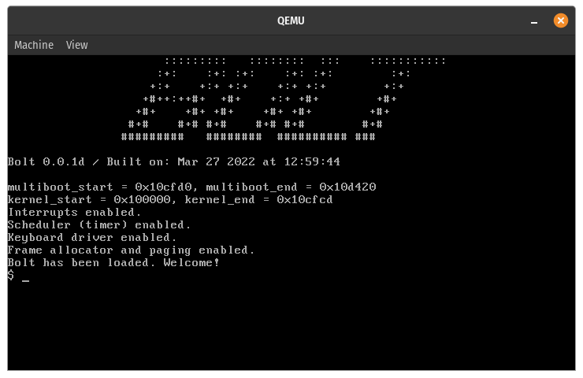

Bolt
====

Bolt is a simple 64bit kernel.

    
    <em><small>Image showcasing Bolt running in QEMU.</small></em>

## Setting up a development environment

The following dependencies are required to build this project:

* `gcc` (`build-essential`)
* `nasm`
* `ld`
* `grub-mkrescue` (part of `grub` or `grub2`)
* `xorriso` (dependency of grub-mkrescue)
* (optional) `qemu`

This project targets `x86_64` architectures, so you likely need a cross-compilation toolchain.

### MacOS

Install [Homebrew](https://brew.sh/), then run the following commands:

    $ brew install nasm
    $ brew install xorriso
    $ brew install qemu

You need to tap `hawkw/x86_64-pc-elf` to install the cross-compilation toolchain:

    $ brew tap hawkw/x86_64-pc-elf
    $ brew install x86_64-pc-elf-gcc

You need to tap `hawkw/grub` to install the GRUB utility:

    $ brew tap hawkw/grub
    $ brew install grub --with-x86_64-pc-elf --HEAD

### Linux

Install the [packages](#setting-up-a-development-environment).

Grab the toolchain by running `make toolchain`.

## Building Bolt

To compile the kernel (ELF 64-bit), run:

    $ make kernel

To build the ISO (this is the default target), run:

    $ make iso

To compile the OS in DEBUG mode, run:

    $ make debug

**Note:** in DEBUG mode, logging uses the serial port `COM1` to write various debugging information. `qemu` is configured to write the output of this serial port to `/tmp/serial.log` and stdout.

To compile the OS in normal mode, and run it in qemu, run:

    $ make run

## License

Bolt is released under the MIT License. See the bundled [LICENSE](LICENSE.md) file for details.